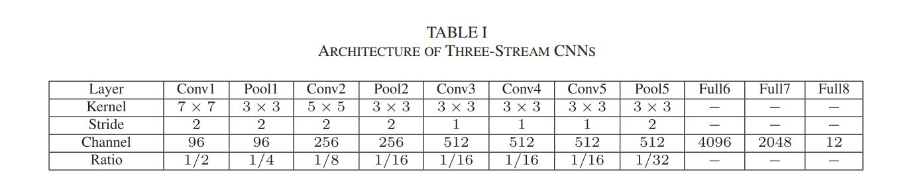

<a href="https://orcid.org/0000-0002-9423-9252" target="orcid.widget" rel="noopener noreferrer" style="vertical-align:top;">orcid.org/0000-0002-9423-9252</a>

Homepage: [https://yangliu9208.github.io/home/](https://yangliu9208.github.io/home/)

Codes for paper "Global Temporal Representation based CNNs for Infrared Action Recognition"
### Abstract
Infrared human action recognition has many advantages, i.e. it is insensitive to illumination change, appearance variability and shadows. Existing methods for infrared action recognition are either based on spatial or local temporal information, however, the global temporal information, which can better describe the movements of body parts across the whole video, is not considered. In this letter, we propose a novel global temporal representation named Optical-Flow Stacked Difference Image (OFSDI) and extract robust and discriminative feature from infrared action data by considering the local, global, and spatial temporal information together. Due to the small size of infrared action dataset, we first apply CNN on local, spatial, and global temporal stream respectively to obtain efficient convolutional feature maps from the raw data rather than train a classifier directly. Then these convolutional feature maps are aggregated into effective descriptors named three-stream trajectory-pooled deep-convolutional descriptors (TSTDDs) by trajectory-constrained pooling. Furthermore, we improve the robustness of these features by using Locality-constrained Linear Coding (LLC) method. With these features, a linear SVM is adopted to classify the action data in our scheme. We conduct experiments on infrared action recognition dataset InfAR and NTU RGB+D. Experimental results show that the proposed approach outperforms the representative state-of-the-art handcrafted features and deep learning features based methods for infrared action recognition.

### Model

Figure 1: Frameworks of our infrared action recognition method and the conventional method. Compared with the conventional method, our method is different in network input, CNNs structure, feature extraction, and classification strategy.

### Network Structure


Table I: The details of three-stream CNNs in terms of kernel, stride, channel size, and map size ratio.

### Datasets

Figure 3: Example images from video sequences on InfAR (first row) and NTU RGB+D (second row) datasets. (a) fight. (b) handclapping. (c) handshake. (d) hug. (e) jog. (f) jump. (g) drop. (f) pickup. (g) throw. (h) sitting down. (i) standing up. (j) clapping.

InfAR dataset can be downloaded [here](https://sites.google.com/site/gaochenqiang/publication/infrared-action-dataset).

NTU RGB+D dataset can be downloaded [here](http://rose1.ntu.edu.sg/Datasets/actionRecognition.asp).

### Codes
(Matlab R2016b or higher version is required to open these files)
1. [Caffe models](https://drive.google.com/open?id=1vTNJLR66cxTwyj9qzsxBuN5k9fxm6aqh). We also release the trained model named "[InfAR_TDDs_rgb_iter_10000.caffemodel](https://drive.google.com/open?id=1ewd8RSUfyinKr_RFK3DfDKeRuu-BlwIv)".  
2. [TSTDDs codes](https://drive.google.com/open?id=1hujdiNyEn9hoDXxOJdfYjMWBwdOADuNG) ("spatial_v2.caffemodel" and "temporal_v2.caffemodel" must be included in the "TSSDDs\model"). 
3. [TSTDDs features](https://drive.google.com/open?id=1fIJ-2XW_4rZba3jzrXUzf2k6GuceD58e) for all the videos on the InfAR dataset. 
4. [Matlab codes](https://drive.google.com/open?id=1OkvbxX4-yqpbBeIbLRzBaOJBv80GALRY) for generating the training and test set. 
5. We release the indices of the [splits](https://drive.google.com/open?id=1B0lopUbC6WAdeTorNxWxG5XfKbnQiv9X) for all the 5 folds here. 

### TSTDDs demo code ###
Here, a matlab demo code for TSTDDs extraction is provided.

**Step 1**: Improved Trajectory Extraction

You need download our modified iDT feature code and compile it by yourself. [Improved Trajectories](https://drive.google.com/open?id=1-xasagLTTL1E3SIKtcwnfMgrkHYVFVvF)

**Step 2**: TVL1 Optical Flow Extraction

You need download our dense flow code and compile it by yourself. [Dense Flow](https://drive.google.com/open?id=1qvBX39hY36N9o2DDIiNsx8uFO-Rm3IJ1)

**Step 3**: Matcaffe

You need download the public caffe toolbox. Our TDD code is compatatible with the latest version of [parallel caffe toolbox](https://github.com/yjxiong/caffe)

**Note that you need to download the models in the new proto format:**

["Spatial net model (v2)"](http://mmlab.siat.ac.cn/tdd/spatial_v2.caffemodel) ["Temporal net model (v2)"](http://mmlab.siat.ac.cn/tdd/temporal_v2.caffemodel) 

**Step 4**: TSTDDs Extraction

Now you can run the matlab file "TSTDDs_main.m" to extract TSTDDs features.
    
If you find the work helpful, please kindly consider to cite our paper by:
```
@article{TSTDDs,
  title={Global Temporal Representation based CNNs for Infrared Action Recognition},
  author={Yang Liu and Zhaoyang Lu and Jing Li and Tao Yang and Chao Yao},
  journal={IEEE Signal Processing Letters},
  volume={25},
  pages = {848-852},
  year={2018},
  doi = {10.1109/LSP.2018.2823910}
}
```
### Reference
Yang, Liu; Zhaoyang, Lu; Jing, Li; Tao, Yang; Chao, Yao. Global Temporal Representation based CNNs for Infrared Action Recognition. IEEE Signal Processing Letters, vol. 25, no. 6, pp. 848-852, June 2018. doi:10.1109/LSP.2018.2823910.

If you have any question about this code, feel free to reach me(aryanr@163.com)

<a href='https://clustrmaps.com/site/1a4ar'  title='Visit tracker'></a>

